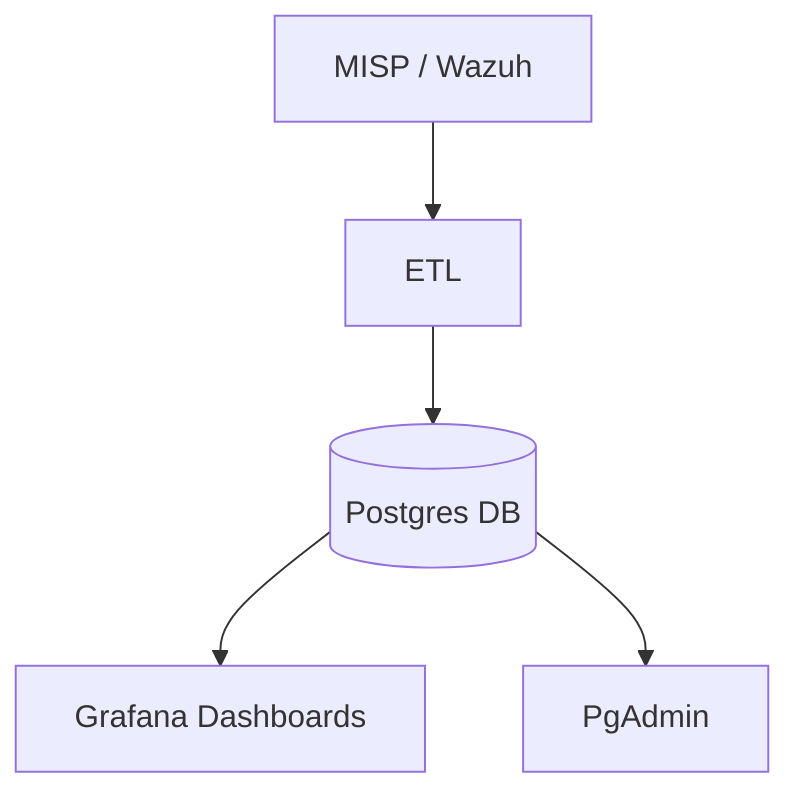

# CTIC Architecture

## Components
- **Postgres**: Stores incidents, indicators, TTPs, campaigns, sightings
- **ETL container**: Ingests threat intel (MISP, Wazuh, demo data)
- **Grafana**: Dashboards visualizing KPIs and compliance metrics
- **PgAdmin**: Developer-only database admin GUI

## Data Flow
1. ETL pulls indicators/sightings
2. Inserts into Postgres
3. Views (e.g., vw_kpis, vw_top_ttps_12m) expose KPIs
4. Grafana queries those views

## Diagram

